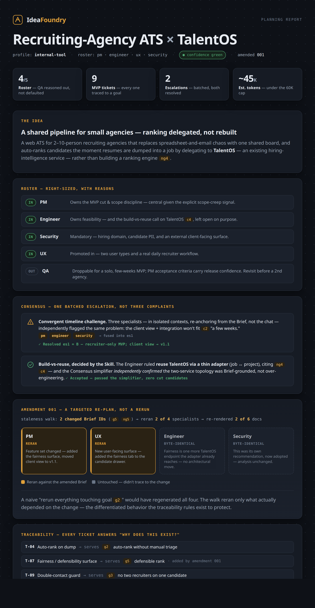
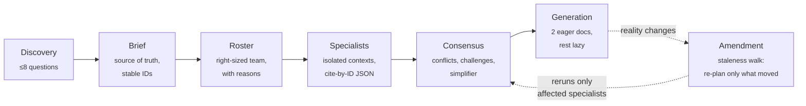

# IdeaFoundry

**Turn an incomplete software idea into an execution-ready planning package.**

IdeaFoundry is a [Claude Skill](https://docs.claude.com/en/docs/claude-code/skills): a reusable software-planning **SDK** — prompt files, schemas, rubrics, and templates — that coordinates a virtual product team (PM, Engineer, UX, Security, QA) to produce *the plan that comes before the code*. It never writes application code. The product is **clarity**.

It scales **down** to an indie dev's weekend hack and **up** to a regulated production build without changing what it is — same methodology, a different roster.

<p align="center">
  <a href="examples/ats-talentos-run/report.html">
    
  </a>
</p>
<p align="center"><sub>A real run — an MVP ATS that reuses <a href="https://github.com/shreyas12/talentOS">TalentOS</a> to rank resumes. Full package in <a href="examples/ats-talentos-run/"><code>examples/ats-talentos-run/</code></a> · <a href="examples/ats-talentos-run/report.html">open the report</a></sub></p>

## Install

Copy this folder into your Claude skills directory (or point Claude Code at it as a project skill). No dependencies, no server, no build step — it is prompt files and rules.

## Use

```
/ideafoundry            # new session — Discovery + profile picker
/foundry                # short form
plan with IdeaFoundry   # natural-language fallback
```

Answer ≤8 Discovery questions → confirm a proposed roster → receive a `planning/` folder plus `PLAN_SUMMARY.md`, `README.md` (doc index), `STATUS.md`, and eager renders of `00-executive-summary.md` + `12-developer-tickets.md`. Every invocation stays **under 60K tokens**.

### Subcommands

| Command | Purpose |
|---|---|
| `/ideafoundry` | New session (Discovery + profile picker) |
| `/ideafoundry <profile>` | Start with a named profile (`weekend-hack`, `internal-tool`, `consumer-app`, `regulated`) |
| `/ideafoundry amend <note>` | Re-plan when reality changes |
| `/ideafoundry render <doc-id>` | Render one on-demand doc |
| `/ideafoundry render all` | Render every roster doc eagerly (opt-in) |
| `/ideafoundry status` | Print current `STATUS.md` |
| `/ideafoundry export` | Package `planning/` for download |
| `/ideafoundry continue` | Resume from a pasted bundle |
| `/ideafoundry help` | List subcommands + current phase |

## How it works



1. **Discovery** — ≤8 conversational questions (six mandatory + adaptive probing) → confirmed **Brief** (single source of truth, stable section IDs).
2. **Roster** — the Skill *proposes* a right-sized team with per-specialist reasoning; you confirm or override.
3. **Specialists** — each runs one-per-turn in a fresh context, re-anchoring from files (not chat history), emitting a **structured JSON planning object** that cites the Brief by ID and never restates it.
4. **Consensus** — a coordinator reads *summaries first*, detects conflicts, batches challenges into a single escalation, runs a simplifier pass, and writes `decisions.json`.
5. **Generation** — renders a normalized `planning/` folder plus a few eager docs; the rest render **lazily** on demand.
6. **Amendment** — when reality changes, `amend` walks the traceability graph, marks only what's stale, and re-runs only the affected specialists.

The whole phase graph is in **[`WORKFLOW.md`](WORKFLOW.md)**. The design rationale is in **[`PLAN.md`](PLAN.md)**; the backlog in **[`TICKETS.md`](TICKETS.md)**; the acceptance evals in **[`EVAL.md`](EVAL.md)**.

## Design principles (enforced, not decorative)

- **Right-sized, never over-scoped.** Each profile declares a *complexity ceiling*; a specialist recommending Kubernetes for a habit tracker must justify it against a Brief constraint or it's a schema violation.
- **Mostly-lazy generation.** Only the 2 docs 90% of people open first are rendered eagerly; you pay tokens for what you read.
- **Challenges, gated.** Specialists can push back on the Brief, but only *material* (high-impact) challenges surface; the rest are logged.
- **Portable state.** The `planning/` folder is the crown jewel; `export`/`continue` move it between sessions and teammates as a single JSON bundle.
- **Token budget is a forcing function.** Every file declares a budget; every invocation stays under 60K.

## Worked examples

Two runs live in [`examples/`](examples/):

| Example | What it is |
|---|---|
| [`internal-tool-run/`](examples/internal-tool-run/) — **DeployGate** | An *authored* fixture: an internal prod-deploy approval tool. Hand-built to exercise the harder paths — a justified ceiling deviation (Postgres over SQLite), a PM-vs-Security separation-of-duties conflict, a compliance section correctly *omitted* for an internal tool. |
| [`ats-talentos-run/`](examples/ats-talentos-run/) — **Recruiting-agency ATS** | A **real run** (the methodology executed end-to-end, not hand-written): an MVP applicant tracking system that reuses an existing service, [TalentOS](https://github.com/shreyas12/talentOS), to rank resumes on dump. Includes the full `planning/` folder, an **amendment** record, two rendered docs, and a one-page [`report.html`](examples/ats-talentos-run/report.html) (the hero above). Start with its [`README`](examples/ats-talentos-run/README.md). |

## What the first real run showed

Running IdeaFoundry on the ATS idea (above) surfaced concrete evidence for the design bets — the parts that separate this from a single well-written planning prompt:

- **Discovery catches scope creep instead of nodding along.** Asked for "the one success metric," the user answered *"all of the above."* The Skill recorded a ranked **primary + secondary**, not three co-equal goals, and sorted auto-posting / scheduling / analytics into `non_goals`. Naming the creep is the feature.
- **Handing it a genuine open decision is where it earns its keep.** The build-vs-reuse call on TalentOS was left *to the Skill*. The Engineer specialist ruled **reuse via a thin adapter**, citing Brief IDs (`ng4`/`c4`), and the Consensus **simplifier independently confirmed** the two-service topology was Brief-grounded rather than over-engineering. That reasoning chain is the payoff of the ceiling + simplifier machinery.
- **Context isolation makes agreement mean something.** PM, Engineer, and Security each re-anchor from *files, not chat history* — so when all three independently flagged the same "few weeks" timeline problem, Consensus could fuse it into **one batched escalation**. Convergence across isolated contexts is signal; one voice repeated three times is not.
- **Amendment is a targeted re-plan, not a rerun — and that's the hard part.** When the user resolved the two escalations, two changed Brief IDs drove the staleness walk to rerun **only PM + UX**, leaving **Engineer + Security byte-identical** (their outputs didn't trace to the changed content) and re-rendering **only 2 of 6** docs. A naive "rerun everything touching goal *g2*" would have regenerated all four — the over-marking failure the traceability rules explicitly guard against. This is the differentiated behavior; the run is proof it fires.
- **The lean path stays cheap.** Rendering only the two eager docs kept the run **well under the 60K budget** (est. ~40–50K). Rendering all docs is what pushes cost up — hence lazy-by-default.

**Honest caveat.** This run was executed by Claude acting as IdeaFoundry's orchestrator, faithfully following the Skill's files — a genuine end-to-end exercise of the methodology, but **not** a sandboxed, instrumented Skill invocation. So the token figures are estimates: the [`PLAN.md`](PLAN.md) §23 calibration caveat is **narrowed, not closed**. Closing it fully needs the Skill installed and invoked with token instrumentation.

## Repository layout

```
ideafoundry/
  SKILL.md              lean router (~250 tokens, loaded every turn)
  WORKFLOW.md           whole phase graph, for humans
  discovery/            mandatory questions, probing rubric, Brief schema
  roster/               roster rubric + profile YAMLs (with complexity ceilings)
  specialists/          PM / Engineer / UX / Security / QA prompts + schemas
  consensus/            coordinator (conflict detection, decisions, simplifier)
  generation/           document generator + templates (each declares requires:/loads:)
  rules/                planning-rules, mvp-rules, RECOVERY (loaded only on error)
  examples/             two worked runs: DeployGate (authored) + ATS/TalentOS (real, with amendment)
  evals/                eval harness + fixtures
```

Version: **schema v1**. Every artifact carries `schema_version: 1`.
